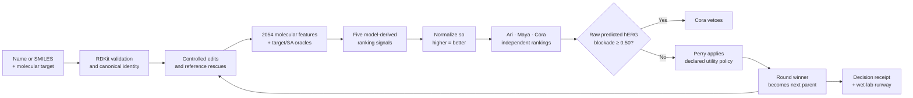

# Agent Perry

**An explainable, safety-gated workspace for early molecular optimization and
wet-lab decision planning.**

Agent Perry starts with a known molecule and a declared biological target,
generates a controlled set of structural alternatives, evaluates competing
activity and ADMET objectives, and records why one candidate should advance.
Instead of hiding every trade-off inside one score, specialist agents expose
their rankings, disagreements, confidence calculations, safety vetoes, and
rejection reasons.

The output is not a drug candidate claim. It is an auditable computational
hypothesis plus a prioritized experiment plan.

> **Prototype scope:** The interface accepts an explicit molecular target, but
> the installed live activity model currently supports **DRD2 only**. Agent
> Perry will not reuse DRD2 scores for another receptor. A new target requires
> a validated target-specific scoring adapter.

## Why Agent Perry?

Lead optimization is a multi-objective problem. A change that improves target
activity can reduce solubility, increase cardiac ion-channel liability, make
brain exposure less likely, or create a molecule that is difficult to
synthesize. A simple average can also hide a critical safety failure.

Agent Perry separates those concerns:

- target activity, ADME, and cardiac safety are evaluated independently;
- hERG risk is enforced as a non-negotiable program gate;
- the official choice follows a reproducible policy rather than an opaque chat
  response;
- every score, ranking, veto, rollback, and source is inspectable; and
- computational conclusions are converted into experiments that could confirm
  or overturn the decision.

## End-to-end pipeline



The product loop has seven stages:

| Stage | What happens |
|---|---|
| **1. Input** | Resolve a known drug name or SMILES into a validated molecular structure and declare the intended target. |
| **2. Design** | Generate controlled structural edits and clearly labeled reference-scaffold alternatives. |
| **3. Predict** | Evaluate target activity, solubility, BBB permeability, hERG liability, and synthetic accessibility. |
| **4. Debate** | Specialists independently rank the same candidate slate and expose disagreement. |
| **5. Gate** | Cardiac-safety policy removes candidates regardless of their average performance. |
| **6. Decide** | Perry selects from eligible candidates, records the trade-off, and creates the next-round brief. |
| **7. Learn** | A wet-lab plan identifies the evidence most useful for confirming or changing the decision. |

## 1. Molecular intake and identity

The user supplies:

- a molecule name or SMILES string; and
- a molecular target such as `DRD2`.

The intake layer first checks a bundled offline catalog. A valid SMILES can be
used directly, and an explicitly enabled PubChem lookup is available as a
fallback. RDKit parses and canonicalizes the structure, calculates the
molecular formula and molecular weight, and creates a stable SHA-256 identifier
from the canonical SMILES.

The built-in catalog contains Haloperidol, Sulpiride, Clozapine, Olanzapine,
and Metoclopramide. Catalog membership validates identity; it does not prove
activity against a user-supplied target.

## 2. Candidate generation

A live mission runs **five rounds with six candidate states per round**. Each
round contains:

1. the current parent molecule as an incumbent control;
2. three sanitized direct edits, prioritizing aromatic fluoro, hydroxyl, and
   ring-nitrogen hypotheses; and
3. two clearly labeled reference-scaffold rescue or comparator candidates when
   needed.

RDKit reaction SMARTS generate the direct edits. Every output must parse,
sanitize, canonicalize, and remain unique within its round. The chosen molecule
becomes the parent of the next round.

Morgan-fingerprint Tanimoto similarity is recorded against the parent and the
starting molecule. This measures structural locality only; it is **not** a
validated model applicability domain.

## 3. Molecular representation and prediction science

### ADMET feature vector

Before the local XGBoost models run, salts or disconnected structures are
reduced to the largest molecular fragment. Each molecule becomes a
**2054-feature vector**:

- a 2048-bit radius-2 Morgan fingerprint describing local substructures; and
- six RDKit descriptors:
  - molecular weight,
  - MolLogP,
  - topological polar surface area (TPSA),
  - hydrogen-bond donors,
  - hydrogen-bond acceptors, and
  - rotatable bonds.

The models used by Agent Perry predict:

| Endpoint | Model output | Why it matters |
|---|---|---|
| **Solubility** | Predicted LogS | Poor aqueous solubility can limit formulation and exposure. |
| **BBB permeability** | Positive-class probability | A CNS program may require exposure across the blood-brain barrier. |
| **hERG blockade** | Positive-class probability | hERG inhibition is an important early cardiac-safety liability. |

These local XGBoost models were developed from Therapeutics Data Commons ADMET
benchmark data using scaffold-aware evaluation. The inherited training
notebooks report:

| Endpoint | Held-out metric | Reported result |
|---|---:|---:|
| Solubility | MAE, lower is better | 0.899 |
| BBB permeability | ROC-AUC | 0.920 |
| hERG blockade | ROC-AUC | 0.856 |

The repository also retains legacy CYP3A4 and clearance models, but those
endpoints are not currently part of Agent Perry's official five-axis decision
policy.

### Target activity and synthetic accessibility

- **Target activity:** Live DRD2 missions use the Therapeutics Data Commons
  DRD2 oracle as a unitless ranking signal.
- **Synthetic accessibility:** RDKit's SA score estimates fragment familiarity
  and structural complexity. Lower raw SA is easier in the heuristic's
  convention.

Neither score establishes binding, function, a synthetic route, yield, cost,
or clinical performance.

## 4. A common objective scale

The five raw values have different meanings and units. Agent Perry maps each
one to a display objective from 0 to 1, where higher is consistently better:

| Objective | Conversion |
|---|---|
| Target activity | DRD2 oracle score |
| Solubility | `clip((predicted LogS + 6) / 6, 0, 1)` |
| BBB permeability | BBB positive-class probability |
| hERG safety | `1 - predicted hERG blockade probability` |
| Synthetic accessibility | `clip((10 - raw SA) / 9, 0, 1)` |

The weighted utility is:

```text
utility =
    0.35 × target activity
  + 0.25 × solubility
  + 0.25 × BBB
  + 0.10 × hERG safety
  + 0.05 × synthetic accessibility
```

The weights describe this demonstration's optimization priorities. They are
transparent program choices, not universal medicinal-chemistry constants.

## 5. The decision agents

All four agents inspect the same six candidates, but they have different roles
and authority:

| Agent | Role | Ranking rule | Authority |
|---|---|---|---|
| **Ari** | Target Activity Specialist | Highest normalized target-activity score | Recommendation |
| **Maya** | ADME Specialist | Mean of normalized solubility and BBB objectives | Recommendation |
| **Cora** | Cardiac Safety Specialist | Highest normalized hERG-safety score | Recommendation and veto |
| **Perry** | Decision Orchestrator | Highest weighted utility among eligible candidates | Official decision |

If at least one novel safe candidate exists, the incumbent is excluded from
Perry's pool for that exploration round. If no novel safe candidate exists, the
incumbent may remain eligible. If every candidate is vetoed, the run stops
instead of producing an unsupported winner.

### Confidence scores

Agent confidence is a reproducible measure of separation inside the current
candidate slate:

```text
confidence = (top score - runner-up score) / (maximum score - minimum score)
```

The result is clipped to `[0, 1]`. A close first and second place produces low
confidence; a well-separated first place produces higher confidence.

This is **not** a calibrated probability that an agent is scientifically
correct. It only reports how decisive that agent's ranking was for the options
it saw.

### Safety gate

Cora vetoes any candidate with:

```text
raw predicted hERG blockade >= 0.50
```

This gate is applied before Perry chooses a winner, so strong activity or
solubility cannot average away a flagged cardiac-safety signal. The threshold
is an explicit prototype policy on a model output—not a clinical cutoff,
measured blockade probability, or regulatory conclusion.

## 6. Explainability and audit trail

Agent Perry does not present hidden chain-of-thought. It exposes structured
decision evidence:

- the exact candidate slate and parent molecule for every round;
- raw predictions, normalized objectives, parent deltas, and structural
  similarities;
- each specialist's complete ranking and preferred candidate;
- confidence value and the arithmetic used to calculate it;
- hERG vetoes and surviving candidates;
- machine-readable rejection reason codes;
- comparisons of affinity-only, ADME-only, safety-only, weighted, and official
  policies;
- Pareto-style safe-frontier labels;
- lineage, exploration, and controlled rollback events; and
- validation checks plus a content-derived mission digest.

Optional LLM responses can be enabled through an OpenAI-compatible endpoint,
but they are **advisory only**. They cannot select the official winner, bypass
the safety gate, or stop deterministic execution.

## Worked example: Haloperidol to the proposed lead

The bundled judged mission is a deterministic, offline replay containing 30
candidate states, 19 unique structures, and 13 hERG-vetoed states.

| Model-derived value | Haloperidol seed | Proposed Sulpiride-like rescue | Direction |
|---|---:|---:|---|
| DRD2 activity | 1.000 | 0.985 | Small modeled decrease |
| Predicted LogS | -4.477 | -2.425 | Improved predicted solubility |
| BBB probability | 0.984 | 0.741 | Reduced but still substantial modeled signal |
| Predicted hERG blockade | 0.865 | 0.371 | Reduced below the program gate |
| Raw SA score | 2.123 | 2.567 | Slightly less favorable heuristic |

The proposed molecule does not win every objective. It advances because it
retains a high modeled DRD2 signal, substantially improves predicted
solubility and hERG liability, survives the fixed safety gate, and has the
highest declared utility in the eligible pool. Later rounds test local
alternatives and deliberately roll back when those edits do not improve the
trade-off.

These values are model outputs. They do not establish that the proposed
molecule is safer, efficacious, synthesizable, or clinically superior.

## 7. From prediction to wet-lab evidence

The final output includes an experiment runway rather than stopping at a
ranking:

| Priority | Experiment | Decision question |
|---:|---|---|
| 1 | LC-MS and analytical purity | Is the tested material the intended compound at suitable purity? |
| 1 | Concentration-response hERG patch clamp | Does measured cardiac ion-channel activity support the model-based gate? |
| 2 | DRD2 binding assay | Does the candidate retain meaningful target affinity? |
| 3 | Gi/cAMP response with beta-arrestin follow-up | Does binding translate into the intended functional pharmacology? |
| 2 | Defined-pH kinetic, then thermodynamic solubility | Is the predicted solubility improvement reproducible? |
| 3 | PAMPA-BBB | Does the molecule show useful passive permeability? |
| 3 | Bidirectional MDCK-MDR1 | Could active efflux limit exposure? |
| 2 | Medicinal-chemist route review | Is there a credible and practical path to test material? |

These assays have different purposes. For example, PAMPA-BBB addresses passive
permeability but not active efflux; binding does not establish receptor
function; and an SA score cannot replace route design.

## Product interface

The Streamlit application contains seven persistent views:

| View | Purpose |
|---|---|
| **Mission** | Validates the structure and explains the target, seed, hypothesis, provenance, and supported scope. |
| **Agents** | Introduces Ari, Maya, Cora, and Perry and explains their decision authority. |
| **Optimize** | Shows five rounds, six candidates per round, score axes, edits, safety states, and lineage. |
| **Decisions** | Exposes rankings, confidence calculations, vetoes, rejection reasons, policy comparisons, and rollback. |
| **Body Map** | Shows limited brain, heart, and solubility-linked directional hypotheses. |
| **Validate** | Converts model claims into a candidate-specific wet-lab plan. |
| **Evidence** | Lists interpretation sources and exports JSON, CSV, or a standalone HTML decision receipt. |

The downloadable HTML receipt regenerates RDKit 2D structures for both the
starting molecule and the proposed molecule. The interactive molecular view
uses deterministic RDKit ETKDGv3 coordinates with optional UFF optimization
and a 2D fallback.

The 3D structure is a visual conformer—not a docking pose, protein-bound
structure, or measured conformation. The Body Map is not a gene-expression or
whole-body simulation.

## Cached replay, narrative replay, and live mode

These are separate concepts:

| Mode | Meaning |
|---|---|
| **Cached judged mission** | Loads the validated `demo_run.json` record. It is deterministic, offline, and requires no API key. |
| **Narrative replay** | A 25-second guided tour through the saved rounds. It does not rerun any model. |
| **Live mission** | Recomputes 30 candidate evaluations with the installed local models, DRD2 oracle, SA scorer, and deterministic policy. |

The cached mission is the recommended presentation path because it removes
network and dependency risk while preserving the exact decision record.

## Run locally

### Existing checkout

From the `AgentOptim` directory:

```bash
git switch suraj_optim
git pull

brew install uv
uv venv --python 3.11 .venv
uv pip install --python .venv/bin/python -r requirements.txt
uv pip install --python .venv/bin/python pytest

.venv/bin/python -m pytest -q
.venv/bin/python scripts/verify_optimization_run.py
.venv/bin/python scripts/verify_decision_room.py
.venv/bin/python -m streamlit run decision_room_app.py
```

`brew install uv` is a one-time macOS setup step. On Linux or a Mac without
Homebrew, follow the official
[`uv` installation guide](https://docs.astral.sh/uv/getting-started/installation/).
If `uv` is installed at `~/.local/bin/uv` but is not on `PATH`, use that full
path in the commands above.

Open <http://localhost:8501>. Press `Control-C` in the terminal to stop the
application.

### Fresh clone

```bash
git clone --branch suraj_optim --single-branch https://github.com/kvaradh/AgentOptim.git
cd AgentOptim
```

Then run the setup commands from the previous section.

### Enable live DRD2 missions

The cached mission works with the base requirements. Live target scoring needs
the optional oracle dependencies:

```bash
uv pip install --python .venv/bin/python -r requirements-oracles.txt
.venv/bin/python scripts/verify_oracles.py
.venv/bin/python -m streamlit run decision_room_app.py
```

Without those packages, **Launch live mission** reports that live DRD2 scoring
is unavailable while the cached replay remains usable.

### Optional advisory LLM notes

Deterministic agents require no API key. To add failure-isolated,
OpenAI-compatible advisory notes:

```bash
export AGENT_API_KEY="..."
export AGENT_MODEL="..."
export AGENT_API_URL="https://provider.example/v1/chat/completions"
```

`AGENT_API_URL` is optional and defaults to OpenAI's chat-completions endpoint.
Never expose a key during a presentation.

## Verification

The repository includes unit, integration, replay-contract, security, export,
and presentation checks.

```bash
.venv/bin/python -m pytest -q
.venv/bin/python scripts/verify_optimization_run.py
.venv/bin/python scripts/verify_decision_room.py
```

The verification scripts confirm:

- the saved mission contains exactly five rounds and six valid molecules per
  round;
- every official winner clears the hERG gate;
- score normalization, agent rankings, confidence, and parent lineage match
  the deterministic contract;
- the inherited 2054-feature ADMET path reproduces fixture values; and
- the seven-view workspace and embedded offline exports are present.

## Project structure

```text
AgentOptim/
├── decision_room_app.py          # Agent Perry Streamlit entry point
├── core/
│   ├── contract.py               # proposal, scoring, normalization, and validation
│   ├── agents.py                 # specialists, safety gate, and official policy
│   ├── runner.py                 # five-round optimization and replay schema
│   ├── scoring.py                # 2054-feature ADMET model path
│   └── llm.py                    # optional advisory-only compatible client
├── mission_control/
│   ├── intake.py                 # names, SMILES, targets, and optional PubChem
│   ├── chemistry.py              # identity, similarity, depictions, and conformers
│   ├── analysis.py               # confidence, ledger, frontier, and wet-lab plan
│   ├── evidence.py               # scientific interpretation sources
│   ├── exports.py                # JSON, CSV, and standalone HTML receipt
│   ├── presentation.py           # self-contained offline workspace compiler
│   └── assets/                   # seven-view HTML, CSS, and JavaScript interface
├── models/                       # local XGBoost model artifacts
├── demo_run.json                 # validated cached five-round mission
├── scripts/                      # build and verification commands
├── tests/                        # automated test suite
├── app.py                        # legacy standalone ADMET predictor
└── *.ipynb                       # inherited model-development notebooks
```

## Scientific boundaries

Agent Perry is research decision-support software. Current limitations include:

- DRD2 is the only installed target-activity adapter;
- model outputs have not been experimentally confirmed for the proposed
  candidates;
- structural similarity is not a validated applicability-domain estimate;
- the fixed hERG gate is a program rule, not a clinical safety threshold;
- the proposal operator is constrained and includes reference rescues rather
  than performing unconstrained de novo design;
- the current policy does not model dose, formulation, metabolism,
  pharmacokinetics, efficacy, selectivity, off-target panels, or in vivo
  toxicity;
- the SA score is not a synthetic route; and
- the body and 3D views are explanatory visualizations, not biological or
  docking simulations.

The next product steps are target-specific adapter support, calibrated
uncertainty and applicability domains, broader PK and off-target endpoints,
synthetic-route constraints, and a feedback loop that updates decisions when
measured assay data arrive.

## Scientific references

- [Therapeutics Data Commons](https://tdcommons.ai/) — ADMET benchmarks and the
  DRD2 oracle.
- [PubChem PUG REST](https://pubchem.ncbi.nlm.nih.gov/docs/pug-rest) — optional
  compound-name resolution.
- [NCATS Assay Guidance Manual: GPCR pharmacology](https://www.ncbi.nlm.nih.gov/books/NBK549462/)
  — binding and functional-assay interpretation.
- [ICH E14/S7B implementation Q&A](https://database.ich.org/sites/default/files/E14-S7B_QAs_Step4_2022_0221.pdf)
  and [FDA cardiac ion-channel voltage protocols](https://www.fda.gov/media/151418/download)
  — hERG follow-up context.
- [Kinetic-solubility analysis](https://pmc.ncbi.nlm.nih.gov/articles/PMC3236531/)
  — assay-condition and interpretation limits.
- [PAMPA-BBB QSAR development and validation](https://www.frontiersin.org/journals/pharmacology/articles/10.3389/fphar.2023.1291246/full)
  — passive-permeability scope.
- [RDKit ETKDG documentation](https://www.rdkit.org/docs/source/rdkit.Chem.rdDistGeom.html)
  — visual conformer generation.
- [Synthetic accessibility score](https://link.springer.com/article/10.1186/1758-2946-1-8)
  — SA-score method.
- [OECD QSAR validation guidance](https://www.oecd.org/en/publications/guidance-document-on-the-validation-of-quantitative-structure-activity-relationship-q-sar-models_9789264085442-en.html)
  — model validation and applicability.
- [NIST Four Principles of Explainable AI](https://www.nist.gov/publications/four-principles-explainable-artificial-intelligence)
  — explanation and knowledge-limit framing.

## Team

Agent Perry was built by **Suraj, Tuhin, Kavin, Srish, and Miles**, five UCSF
students pursuing the **AI and Computational Drug Discovery and Development
(AICD3)** master's program.
